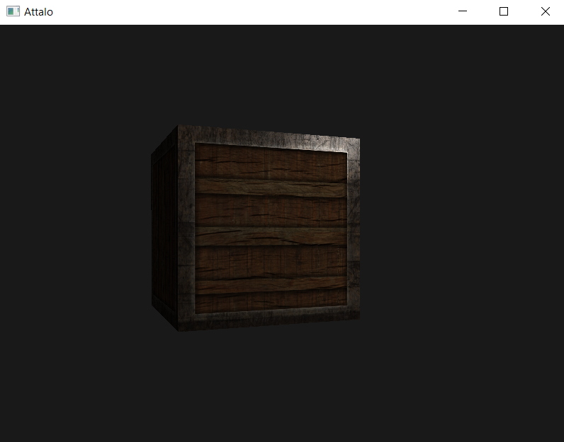

# Attalo

Simple 3D Engine designed with [OpenGL](https://www.opengl.org/) and [GLFW](https://www.glfw.org/) | [C++](https://www.cplusplus.com/)

Current state is very rudimentary.

v0.0.2 - Material and Specular Support

v0.0.1 - Simple Lights
